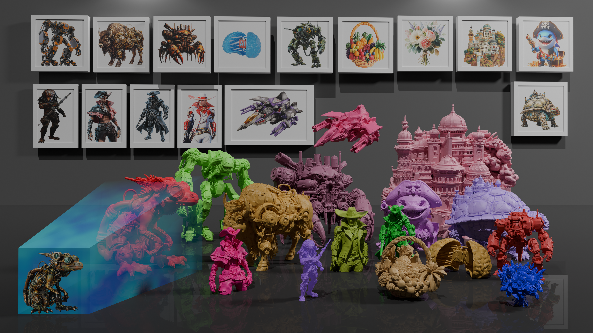

<div align="center">

# BlueFox3D 1.0

Image-to-3D generation with pixel-aligned geometry and PBR textures.

</div>

<div align="center">
    
</div>

**BlueFox3D** generates high-fidelity 3D assets from a single image (or posed multi-view images). It lifts pixel features into 3D through back-projection so the mesh stays aligned with the input.

Weights are hosted on Hugging Face at [`Hydrilla/BlueFox3D`](https://huggingface.co/Hydrilla/BlueFox3D). They download automatically on first run into `~/.cache/huggingface/hub/`.

This repository is inference and training **Python code only**. It does **not** compile FlexGEMM, o_voxel, or flash-attn. Install [TRELLIS.2](https://github.com/microsoft/TRELLIS.2) first and use that environment.

---

## Clone and run

### 1. Clone this repo

```bash
git clone <this-repo-url> BlueFox3D1.0
cd BlueFox3D1.0
```

### 2. Install TRELLIS.2 first

Follow the [TRELLIS.2 installation guide](https://github.com/microsoft/TRELLIS.2) and activate that environment. BlueFox3D imports the CUDA extensions already built there (FlexGEMM, o_voxel, flash-attn, nvdiffrast).

### 3. Install BlueFox3D dependencies

```bash
pip install -r requirements.txt
```

Install natten (replace `xx` with your GPU CUDA architecture and worker count):

```bash
NATTEN_CUDA_ARCH="xx" NATTEN_N_WORKERS=xx pip install natten==0.21.0 --no-build-isolation
```

Install utils3d:

```bash
pip install https://github.com/LDYang694/Storages/releases/download/20260430/utils3d-0.0.2-py3-none-any.whl
```

### 4. Pin `huggingface_hub` (do not upgrade to 1.x)

`transformers==4.57.3` in this repo requires Hub 0.x:

```bash
pip install "huggingface_hub>=0.34,<1.0"
```

Do **not** run `pip install -U huggingface_hub`. Hub 1.x breaks this stack.

### 5. Run inference

```bash
python inference.py --image assets/images/1_img.png --output ./output.glb --low_vram --resolution 1536
```

`--low_vram` is required on 24 GB GPUs (L4 and similar). First run downloads [`Hydrilla/BlueFox3D`](https://huggingface.co/Hydrilla/BlueFox3D) plus DINOv3 / MoGe / rembg into `~/.cache/huggingface/hub/`.

If `flash_attn` is not available, use PyTorch SDPA:

```bash
ATTN_BACKEND=sdpa python inference.py --image assets/images/1_img.png --output ./output.glb --low_vram --resolution 1536
```

Override the checkpoint with `BLUEFOX3D_MODEL` or `--model_path`.

> `requirements-hfdemo.txt` is for the Hugging Face Spaces demo (H-series GPUs) and may not match other architectures.

---

## Package

| | |
|---|---|
| Default weights | `Hydrilla/BlueFox3D` |
| Env override | `BLUEFOX3D_MODEL` |
| Config | `bluefox3d/config.py` → `DEFAULT_MODEL_PATH` |
| Pipelines | `BlueFox3DImageTo3DPipeline`, `BlueFox3DMVImageTo3DPipeline` |

---

## Multi-view inference

When you have several views of the same object:

```bash
python inference_mv.py --views_dir assets/mv_images/example --output ./output_mv.glb --low_vram
```

Put images plus a `transforms.json` in that directory (Blender/NeRF camera-to-world, Z-up). `--low_vram`, `--resolution`, and `ATTN_BACKEND` work the same as single-image inference. `--num_views N` uses only the first N views.

If your views are a 90° orbit at eye level, reuse `assets/mv_images/example/transforms.json` and point each `file_path` at your images. The first frame should be the front view.

---

## Web demo

```bash
python app.py --low_vram
```

Or `LOW_VRAM=1 python app.py`. The UI defaults to 1024 in low-VRAM mode (1536 otherwise).

---

## Training

The training codebase and `data_toolkit/` are included. Prepare view-aligned O-Voxel data by following [data_toolkit/README.md](data_toolkit/README.md).

BlueFox3D is a three-stage cascade (sparse structure → shape → texture). Start from the lowest resolution in each stage and raise it with `finetune_ckpt` in the config.

```sh
python train.py \
  --config <CONFIG_JSON> \
  --output_dir <OUTPUT_DIR> \
  --data_dir '<DATA_DIR_JSON>'
```

`--data_dir` is a JSON string. Sparse structure needs `base`, `ss_latent`, `render_cond`; shape needs `base`, `shape_latent`, `render_cond`; texture needs `base`, `shape_latent`, `pbr_latent`, `render_cond`. Example configs live in `configs/gen/`.

---

## Acknowledgements

BlueFox3D builds on [TRELLIS.2](https://github.com/microsoft/TRELLIS.2), [Direct3D-S2](https://github.com/DreamTechAI/Direct3D-S2), [Trellis](https://github.com/microsoft/TRELLIS), and [MoGe](https://github.com/microsoft/MoGe). Required upstream attribution is in [NOTICE](NOTICE).

```bibtex
@article{li2026pixal3d,
    title={Pixal3D: Pixel-Aligned 3D Generation from Images},
    author={Li, Dong-Yang and Zhao, Wang and Chen, Yuxin and Hu, Wenbo and Guo, Meng-Hao and Zhang, Fang-Lue and Shan, Ying and Hu, Shi-Min},
    journal={arXiv preprint arXiv:2605.10922},
    year={2026}
}
```

## License

This project is released under the [MIT License](LICENSE). Third-party components remain under their original terms; see [NOTICE](NOTICE).
